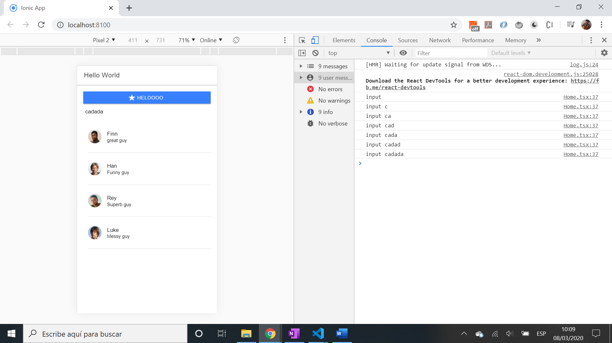

# :zap: Ionic React Firebase

* App using Ionic with React to store data in a Firebase backend. All code from tutorial by [codedamn](https://codedamn.com/)
* **Note:** to open web links in a new window use: _ctrl+click on link_


## :page_facing_up: Table of contents

* [:zap: Ionic React Firebase](#zap-ionic-react-firebase)
  * [:page_facing_up: Table of contents](#page_facing_up-table-of-contents)
  * [:books: General info](#books-general-info)
  * [:camera: Screenshots](#camera-screenshots)
  * [:signal_strength: Technologies](#signal_strength-technologies)
  * [:floppy_disk: Setup](#floppy_disk-setup)
  * [:computer: Code Examples](#computer-code-examples)
  * [:cool: Features](#cool-features)
  * [:clipboard: Status & To-Do List](#clipboard-status--to-do-list)
  * [:clap: Inspiration](#clap-inspiration)
  * [:file_folder: License](#file_folder-license)
  * [:envelope: Contact](#envelope-contact)

## :books: General info

* React [Effect Hook](https://reactjs.org/docs/hooks-effect.html) used to manually change the DOM, equivalent of lifecycle methods componentDidMount, componentDidUpdate & componentWillUnmount combined.
* Uses [ion-toast notifications](https://ionicframework.com/docs/api/toast)

## :camera: Screenshots



## :signal_strength: Technologies

* [Ionic/React v5](https://www.npmjs.com/package/@ionic/react)
* [React v17](https://reactjs.org/) JavaScript library
* [React Redux v7](https://react-redux.js.org/)
* [React Dev Tools Chrome extension](https://chrome.google.com/webstore/detail/react-developer-tools/fmkadmapgofadopljbjfkapdkoienihi/related)

## :floppy_disk: Setup

* Install dependencies using `npm i`
* Create your own firebase console project and add firebaseConfig to `firebaseConfig.ts`
* Run `ionic serve` to open the dev server at `http://localhost:8100/`

## :computer: Code Examples

* login function from `login.tsx`

```typescript
async function login() {
    setBusy(true)
    const res: any = await loginUser(username, password)
    if (res) {
      console.log('login res', res)
      dispatch(setUserState(res.user.email))
      history.replace('/dashboard')
      toast('You have logged in')
    }
    setBusy(false)
  }
```

## :cool: Features

* [React Effects](https://reactjs.org/docs/hooks-effect.html) - `componentDidMount`, `componentDidUpdate` & `componentWillUnmount` combined, and embrace [JavaScript closures](https://developer.mozilla.org/en-US/docs/Web/JavaScript/Closures#:~:text=A%20closure%20is%20the%20combination,scope%20from%20an%20inner%20function.)
* Redux reducers used to modify state
* [DOM Window object browser session history](https://developer.mozilla.org/en-US/docs/Web/API/History_API) used to navigate
* [React Redux useDispath method](https://react-redux.js.org/api/hooks#usedispatch) used to dispatch actions

## :clipboard: Status & To-Do List

* Status: Tutorial completed - all 26 videos completed. Register and Login functions work however when routed to /dashboard just shows a blank screen. Do not update.
* To-Do: Solve issue of /dashboard page - likely an issue with 'dispatch' in `Dashboard.tsx`.

## :clap: Inspiration

* [CodeDamn Youtube Video Series: Ionic + React + Firebase #1 to #26](https://www.youtube.com/watch?v=WugT638KS3Q)
* [Ionic api list of people to use in app](https://ionicframework.com/docs/demos/api/list/)
* [Eslint doc: disallow variable redeclaration (no-redeclare)](https://eslint.org/docs/rules/no-redeclare#disallow-variable-redeclaration-no-redeclare)

## :file_folder: License

* This project is licensed under the terms of the MIT license.

## :envelope: Contact

* Repo created by [ABateman](https://github.com/AndrewJBateman), email: gomezbateman@yahoo.com

